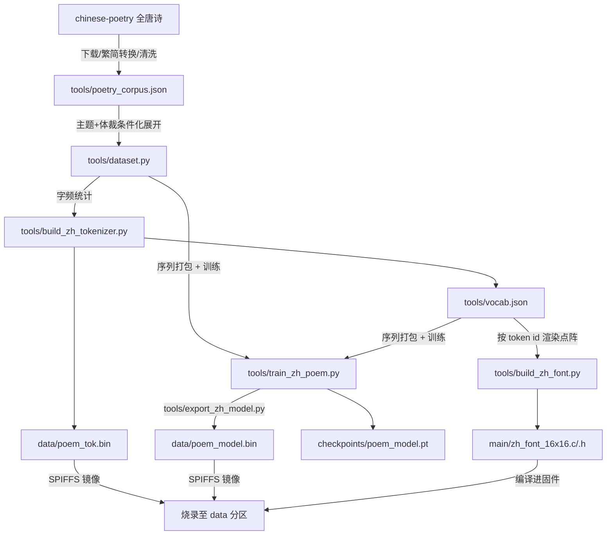

# ESP32-S3 中文诗词大模型（Chinese Poetry LLM）技术方案

> **文档状态**：本文描述**当前已实现**的系统。文末 §10 保留了立项时的原始设计目标，并说明最终实现为何与之偏离——两者差距较大，阅读旧版本文档时请以本文正文为准。

## 1. 项目概述与设计目标

本项目基于 ESP32-S3 硬件平台与纯 C 推理引擎，构建一个完全在微控制器端侧离线运行的**中文古典诗词生成系统**。

### 核心目标

1. **端侧完全离线推理**：不依赖网络或外部 API，在 ESP32-S3 上完成 Transformer 前向传播、自回归采样与流式生成。
2. **主题与体裁可控生成**：模型以 `主题：{关键词} 体裁：{五绝/七绝/…}` 条件化训练，用户可指定意象与格律形式。
3. **在极小参数量下保住可读性**：受限于 tok/s 与 PSRAM 预算，模型压到 75 万参数；通过扩大字表覆盖率、序列打包提升有效训练量来换取生成质量。
4. **全套自动化训练工具链**：从语料清洗、字表提取、PyTorch 训练、二进制导出到屏幕点阵字库生成的完整开源脚本。
5. **板载彩屏古典排版显示**：Waveshare 2.0 寸 ST7789 彩屏上以 16x16 点阵逐字打字机式呈现。

---

## 2. 硬件资源与实际占用

### 2.1 硬件配置

- **主控芯片**：ESP32-S3（Dual-core Xtensa LX7 @ 240MHz）
- **外部内存**：8MB Octal (OPI) PSRAM @ 80MHz
- **板载存储**：16MB Quad SPI Flash
- **显示外设**：Waveshare 2.0 寸 240x320 IPS 彩屏（ST7789，40MHz SPI，背光 GPIO 1）

### 2.2 实际内存与存储占用

| 资源项 | 硬件上限 | 实际占用 | 说明 |
| :--- | :--- | :--- | :--- |
| 模型权重 | 8.0 MB (PSRAM) | **2.87 MiB** | 启动时整文件读入单一 malloc 缓冲区常驻 |
| KV Cache | 8.0 MB (PSRAM) | **480 KB** | K/V 各 `n_layers × seq_len × kv_dim × 4B` = 5×128×96×4 = 240KB |
| 激活值缓冲 | 8.0 MB (PSRAM) | < 0.1 MB | `RunState` 各临时向量 |
| 点阵字库 | 16 MB (Flash) | **64 KB** | 2048 × 32B，经 `linker.lf` 显式留在 Flash |
| SPIFFS 分区 | 16 MB (Flash) | **4 MB** 分区 | 存放权重（2.87MB）与分词器（22KB） |

平台不支持真正的 mmap，`read_checkpoint()` 将整个 `.bin` 读入一块 malloc 内存，`memory_map_weights()` 在其中移动指针切分各权重张量；`munmap`/`close` 封装为 `free` 与空操作，仅为保持与上游 llama2.c 签名兼容。

---

## 3. 模型与分词器架构

### 3.1 词表设计

字符级词表，容量 **2048**，由 `tools/build_zh_tokenizer.py` 按语料字频统计生成。

ID 布局（与代码一致）：

| ID 区间 | 内容 |
| :--- | :--- |
| `0` – `3` | `<unk>`、`<s>`（BOS）、`</s>`（EOS）、`\n` |
| `4` – `12` | 中文标点 `，` `。` `！` `？` `、` `；` `：` `《` `》` |
| `13` | 空格（`主题：X 体裁：Y` 的字段分隔符） |
| `14` – `23` | 数字 `0`–`9` |
| `24` – `2047` | 按语料词频降序排列的 2024 个汉字 |

**覆盖率**：2048 词表覆盖训练文本 **96.45%** 的字次，`<unk>` 率 **3.55%**。（词表 1024 时 `<unk>` 率高达 12.06%，且 97% 的样本至少含一个 `<unk>`，是早期生成质量差的主因。）

各容量实测覆盖率，供后续调参参考：

| vocab_size | 覆盖率 | UNK 率 | 权重文件 |
| :--- | :--- | :--- | :--- |
| 1024 | 87.94% | 12.06% | 2.50 MiB |
| 1536 | 93.53% | 6.47% | 2.68 MiB |
| **2048（当前）** | **96.45%** | **3.55%** | **2.87 MiB** |
| 3072 | 98.94% | 1.06% | 3.24 MiB |
| 4096 | 99.72% | 0.28% | 3.62 MiB |

继续扩表的代价主要在输出投影层（与词嵌入共享权重）：vocab 2048 时该层占总参数 26%，每 token 都要算一次 `dim × vocab` 的矩阵乘，直接影响 tok/s。

### 3.2 Transformer 网络结构

```text
+-----------------------------------------------------------+
|              中文诗词 Transformer 实际规格                  |
+--------------------------+--------------------------------+
| 隐藏层维度 (dim)          | 96                             |
| 前馈网络维度 (hidden_dim) | 256                            |
| 网络层数 (n_layers)       | 5                              |
| 注意力头数 (n_heads)      | 6 (每头 head_size = 16)        |
| KV 共享头数 (n_kv_heads)  | 6 (即 MHA，未使用 GQA)          |
| 词表大小 (vocab_size)     | 2048                           |
| 最大上下文长度 (seq_len)   | 128 tokens                     |
| 参数量 (Parameters)       | 750,624 (Float32)              |
| 权重文件大小               | 3,010,716 B ≈ 2.87 MiB         |
+--------------------------+--------------------------------+
```

结构细节：RMSNorm 前置归一化、RoPE 旋转位置编码、SwiGLU 前馈（`w2(silu(w1(x)) * w3(x))`）、词嵌入与输出层**权重共享**（导出头部 `vocab_size` 取正值表示 shared weights）。

参数构成：词嵌入 2048×96 = 196,608；每层 (4×96×96 注意力 + 3×96×256 前馈 + 2×96 归一化) = 110,784，共 5 层 553,920；末层归一化 96。

---

## 4. 训练工具链



### 4.1 语料获取（`tools/download_corpus.py`）

- 来源：[chinese-poetry](https://github.com/chinese-poetry/chinese-poetry) 全唐诗，默认拉取 12 卷。
- 清洗：`zhconv` 繁转简；剔除含 `□`/`{`/`*` 的残缺文本；长度限制 10–120 字（聚焦绝句与律诗）。
- 产出：约 **10,803 首**，存为 `tools/poetry_corpus.json`（标题/作者/正文）。

### 4.2 样本构造（`tools/dataset.py`）

每首诗展开为多条条件化样本：

```
主题：{关键词} 体裁：{体裁}\n{正文}
体裁：{体裁}\n{正文}
主题：{关键词}\n{正文}
{正文}                        # 无条件样本
```

正文是**单行**文本，句间以 `，。` 分隔（不是每句一个换行）。全部样本共约 **43,203** 条。

**体裁判定**（`get_poem_meter`）：按 `，。` 切分后要求各句等长，否则不打体裁标签（避免给出无意义的先验）。5 字：4 句→`五绝`、8 句→`五律`、其他→`五言`；7 字同理。

**主题抽取**（`extract_themes_for_poem`）：在「标题+正文」中匹配 32 个常用意象词（`COMMON_THEMES`），另附加一个单字主题（月/风/花/雪/…）。注意主题匹配包含正文，因此模型学到的更接近「把主题词写进诗里」而非语义主题建模。

> **设计取舍**：早期版本在无匹配时回退用 `title[:4]` 作主题，产生 624 个只出现一次的伪主题（占主题实例 11.5%），其中 57% 含 OOV 字符，实际编码为 `主题：<unk><unk>\n`——等于在教模型「主题槽位是噪声」。现已移除该回退。

**数据集划分**（`get_poem_split_ids`）：**按诗**而非按样本划分（默认 5% 验证集，`seed=1337`）。一首诗会展开成 4–10 条样本，按样本划分会让同一首诗同时出现在训练与验证集中，验证 loss 完全失真。

### 4.3 分词器生成（`tools/build_zh_tokenizer.py`）

统计字频取 Top 字符填满 2048 词表，输出 `tools/vocab.json` 与 llama2.c 二进制格式 `data/poem_tok.bin`（4 字节 `max_token_length` 头 + 每 token 的 `score(f32) / len(i32) / bytes`）。

因为词表全是单字符 token，llm.c `encode()` 的 BPE 合并循环不会命中任何多字符条目，实际退化为逐字查表——这是预期行为。

### 4.4 训练（`tools/train_zh_poem.py`）

| 超参数 | 取值 |
| :--- | :--- |
| 步数 | 6000（验证 loss 约 2500 步触底，尾段由最优权重回滚兜住） |
| Batch size | 32 |
| 序列长度 | 128 |
| 优化器 | AdamW（betas 0.9/0.95，weight_decay 0.01） |
| 学习率 | 3e-3 → 1e-4，余弦退火，200 步 warmup |
| 梯度裁剪 | 1.0 |
| 随机种子 | 1337（`random` 与 `torch` 均固定） |
| 验证 | 每 500 步，40 个 batch 取平均 |

**序列打包（Sequence Packing）**：所有样本以 `<s>…</s>` 包裹后拼成一条连续 token 流（训练集约 **260 万** token，验证集约 **13.9 万**），每步从流中随机切 129 长的窗口。

早期版本采用 pad 到 `seq_len` 的方案，但诗词样本平均仅 63 token，**约 51% 的算力浪费在 padding 上**，且 1400 步只跑到约 1 个 epoch（明显欠拟合）。改为打包后，6000 步约等于 **9.4 个 epoch** 的有效训练量。

**混合精度**：CPU 与 CUDA 均使用 **bfloat16** autocast，XPU 保持 fp32。

> ⚠️ 不要改回 fp16：CUDA 上 fp16 autocast 必须配 `torch.amp.GradScaler`，否则梯度静默下溢归零，训练看似在跑实则大量梯度为零。bf16 动态范围与 fp32 相同，无需 scaler。

**最优权重回滚**：语料仅约 1.08 万首诗却展开成约 4.3 万条样本，每首诗被反复看到，因此**验证 loss 在约 2500 步触底后开始回升**——最后一步并不是最好的一步。脚本记录验证 loss 最低时的权重，训练结束后回滚到该权重再采样与导出。

> ⚠️ 不要因此把 `MAX_STEPS` 调小到 3000。该常量同时是余弦退火的衰减跨度：缩短后 LR 衰减更快，最优点反而更差——实测 3000 步计划最低 4.4259，6000 步计划最低 4.3865（两者最优点都在第 2500 步附近）。有了回滚机制，较长且衰减较慢的计划严格更优，代价仅为墙上时间。

当前发布模型的验证 loss 曲线（Arc 130T，6000 步）：

| 步数 | 500 | 1000 | 1500 | 2000 | **2500** | 3000 | 4000 | 5000 | 6000 |
| :--- | :--- | :--- | :--- | :--- | :--- | :--- | :--- | :--- | :--- |
| 验证 loss | 4.85 | 4.60 | 4.46 | 4.40 | **4.3533** | 4.42 | 4.50 | 4.59 | 4.63 |

导出的即为第 2500 步的权重（val 4.3533），而非第 6000 步（val 4.6344）。

**硬件自适应**：自动检测 CUDA → Intel XPU → CPU，三者均走 bfloat16 autocast。CPU 路径绑定 P-Core 线程池（`OMP_NUM_THREADS`、`KMP_AFFINITY`）并在可用时应用 IPEX；XPU 路径不需要 IPEX（PyTorch 2.5 起 Intel GPU 支持已并入上游）。

token 流一次性常驻目标设备，batch 在设备内 gather——若每步在 host 侧用 Python list 建 batch 再拷贝，GPU 会被 host→device 传输拖住。

**实测吞吐**（Core Ultra 5 225H / Arc 130T，batch 32 × seq 128）：

| 后端 | ms/step | 6000 步实测总耗时 |
| :--- | :--- | :--- |
| CPU（7 线程） | 约 152 | 910 s（15.2 min） |
| **XPU（Arc 130T）** | **约 66** | **493 s（8.2 min）** |

即端到端约 **1.85 倍**加速（纯计算段的微基准为 3.5 倍；端到端还包含语料加载、分词器构建与验证评估等 CPU 侧固定开销）。

产出 `checkpoints/poem_model.pt`（PyTorch state_dict，可续训或重新导出）与 `data/poem_model.bin`（固件用）。

> ⚠️ checkpoint 必须存在 `data/` 之外。`main/CMakeLists.txt` 的 `spiffs_create_partition_image(data ../data FLASH_IN_PROJECT)` 会把 `data/` 整个目录原样打包进 4MB SPIFFS 分区——早期版本把 `.pt`（~2.9MB）也存进了 `data/`，叠加 `poem_model.bin`（~2.9MB）后总量超出分区，`idf.py build` 直接在 `spiffsgen.py` 阶段报 `SpiffsFullError: the image size has been exceeded`。

### 4.5 权重导出（`tools/export_zh_model.py`）

llama2.c 二进制格式：

1. **28 字节头**：`dim, hidden_dim, n_layers, n_heads, n_kv_heads, vocab_size, seq_len`（7 × int32）。`vocab_size` 取正值表示词嵌入与输出层共享权重。
2. **权重区**：词嵌入 → 各层 `attention_norm` → `wq` → `wk` → `wv` → `wo` → `ffn_norm` → `w1` → `w2` → `w3` → 末层 `norm`，均为连续 float32（按张量类型分组，而非按层分组）。
3. **RoPE 占位**：`seq_len × head_size` 个零（上游 legacy 格式的 `freq_cis_real/imag`），llm.c 实际在运行时自行计算 RoPE，此区仅为保持格式兼容。

### 4.6 屏幕点阵字库（`tools/build_zh_font.py`）

按 `vocab.json` 的 token id 顺序，用系统 CJK 字体（默认 SimHei）渲染 16x16 单色点阵，输出 `main/zh_font_16x16.c`（数组定义）与 `.h`（`extern` 声明 + `ZH_FONT_COUNT`）。

- **位序**：每字 32 字节 = 16 行 × 2 字节，MSB 为最左像素，与 `display_driver_append_token()` 的解包循环一致。
- **定位**：所有汉字共用一个由参考字「國」推导的 em 方框原点，保留字体设计的相对位置（`月` 填满字面，`，` 落在左下）。若逐字按墨迹居中，标点会浮到行中央。ASCII 数字额外做水平居中。
- **空白字形**：`<unk>`/`<s>`/`</s>`/`<extra_N>` 等特殊 token 与空白字符渲染为全零。

> ⚠️ **这是整条流水线最容易踩的坑**：该表按 token id 直接索引，只对生成它的那份 `vocab.json` 有效。词表顺序由语料字频决定，改语料、改 `dataset.py`、改 `VOCAB_SIZE` 都会使其失效。失效表现是**静默的**——`display_driver_append_token()` 只是一次数组查表，越界直接 `return`，不越界就画出错字，全程无报错。串口输出走 UTF-8 解码路径不受影响，因此「串口正常但屏幕乱码」即是此问题。**重建词表后必须重跑本脚本。**

### 4.7 PC 端韵律模拟器（`tools/generate_zh_poem.py`）

在 PC 上从 `.bin` 复原模型并生成，用于快速迭代而无需反复烧录。叠加**约束解码**实现押韵：

- **韵表**：用 `pypinyin` 取韵母，归为 12 个韵部。**这是中华通韵（现代普通话），不是平水韵**——平水韵需要入声与历史韵部数据，拼音原理上无法还原。
- **约束方式**：生成开始前**先随机选定**目标韵部，在第 2 句与第 4 句的末字位置将非目标韵部 token 的 logits 置 `-inf`。

  早期版本是在第 2 句生成完毕后「捕获」其末字韵部再约束第 4 句，问题是第 2 句本身不受约束，若它落在未分类字上（韵部 0/-1），整个约束会静默失效。改为预先选定后两处都受控。
- **状态机**：按 `，`/`。` 推进句序。句号无论出现在第 1 句还是第 2 句之后都推进到下半首（语料中存在标点不规则的诗，早期版本遇到第 1 句以 `。` 结尾时会卡住，导致韵部永远设不上）。
- 首句入韵（部分绝句格式要求）未实现。

---

## 5. ESP-IDF C 固件推理引擎

### 5.1 中文 UTF-8 流式解码

上游 `decode()` 仅适配 ASCII 与英文 BPE。本项目词表直接存储汉字的 3 字节 UTF-8 编码，每个采样出的 token 即一个完整汉字或标点，经 `safe_printf` 流式推向串口，同时调 `display_driver_append_token()` 上屏。

### 5.2 移除 SentencePiece dummy 前缀

上游 `encode()` 会在 BOS 之后插入一个空格 token（SentencePiece 的 `add_dummy_prefix` 习惯）。本模型训练样本**从不以空格开头**——语料中的空格只作为 `主题：X 体裁：Y` 的字段分隔符出现在中间。保留该前缀会让每次生成都从训练中未见过的上下文起步，且导致 PC 模拟器与端侧行为不一致。

**该段代码已移除，修改 `encode()` 时切勿加回。**

### 5.3 提示词

提示词轮播列表硬编码于 `main/main.c` 的 `prompts[]`，采用训练时的条件化格式（`主题：明月 体裁：五绝\n` 等），数组末尾的 `NULL` 表示无提示词自由创作。

`llm.c` 中虽定义了 `read_stdin()`，但当前未接入串口交互输入。

### 5.4 双核并发与 ESP-DSP 加速

`matmul()` 与 `forward()` 内的注意力循环将计算对半拆分，Core 0 与 Core 1 上的绑核 FreeRTOS 任务（`matmul_task` / `forward_task`）并发执行，经信号量与 `xEventGroupSync` 屏障同步。矩阵乘核心使用 `dsps_dotprod_f32_aes3` SIMD 点积。

> 词表 1024 时实测约 36.6 tok/s。扩到 2048 后输出投影层参数翻倍（占总参数 26%），实际速率需在硬件上重新测量。

---

## 6. ST7789 彩屏渲染

### 6.1 中文字库渲染

16x16 点阵单色字模，`display_driver_append_token()` 按 token id 查 `zh_font_16x16[]`，展开为前景/背景 RGB565 像素后经 `esp_lcd_panel_draw_bitmap()` 推送单字。

### 6.2 当前排版行为

```text
+------------------------------------------+
|  [标题栏]                                 |
+------------------------------------------+
|  诗句卡片区（金色字 / 深色底）              |
|  逐字打字机式出现，满 14 字自动换行         |
|  最多 5 行，超出丢弃                       |
+------------------------------------------+
|  [速率状态卡] Speed: xx.xx tok/s          |
+------------------------------------------+
```

字符步进 18px、行距 26px，起点为卡片左上角固定偏移。

**尚未实现**：按五言/七言计算水平垂直居中的对齐排版；诗题渲染（模型也不生成诗题，`dataset.py` 已丢弃标题字段，仅保留主题/体裁条件）；12x12 小号字模。当前是固定 14 字折行的朴素布局。

---

## 7. 存储分区规划

```csv
# Name,   Type, SubType,  Offset,   Size,  Flags
nvs,      data, nvs,     0x9000,  0x6000,
phy_init, data, phy,     0xf000,  0x1000,
factory,  app,  factory, 0x10000, 1M,
data,     data, spiffs,  ,        4M,
```

Flash 总容量 16MB，SPIFFS `data` 分区 **4MB**，存放模型权重（2.87MiB）与分词器（22KB），余量充足。

### 7.1 `linker.lf` 内存映射

```
[mapping:main]
archive: libmain.a
entries:
    * (noflash)              # libmain.a 整体放入 IRAM/DRAM 提速
    zh_font_16x16 (default)  # 但 64KB 点阵表留在 Flash
```

字库是只读位图，每渲染一个字才访问一次，从带缓存的 Flash 读取的开销可忽略；而 ESP32-S3 片上 SRAM 仅 512KB，64KB 应当留给模型与 KV Cache。

---

## 8. 已知限制

1. **主题条件化本质是复制**：主题词匹配包含正文，模型学到的是「把主题词写进诗里」，而非语义层面的主题建模。
2. **押韵约束仅在 PC 端**：`generate_zh_poem.py` 的约束解码尚未移植到固件，板上生成不保证押韵。
3. **无平仄约束**：平仄需要中古音调数据，当前完全未实现。
4. **格律长度不强制**：`体裁` 标签给出统计先验，但没有硬性长度约束，模型可能生成不合规句长。
5. **参数量受限**：75 万参数对古典诗词而言仍然很小，语义连贯性有限。

---

## 9. 复现步骤

```bash
python tools/download_corpus.py      # 语料
python tools/train_zh_poem.py        # 训练 + 导出（内部自动建词表）
python tools/build_zh_font.py        # 字库（必须，见 §4.6）
idf.py build
idf.py -p COMx flash monitor
```

Python 环境见仓库内 `.venv/`（torch CPU 版、Pillow、pypinyin、zhconv）。

---

## 10. 附：原始设计目标与实际实现的偏离

立项时的设计文档给出了一组更激进的指标，实现过程中因 tok/s 与内存预算做了下调。保留此表以说明差异来源：

| 参数 | 原始设计 | 实际实现 | 偏离原因 |
| :--- | :--- | :--- | :--- |
| `dim` | 160 | 96 | 每 token 计算量随 dim² 增长，160 下 tok/s 不可接受 |
| `hidden_dim` | 480 | 256 | 同上 |
| `n_layers` | 6–8 | 5 | 同上 |
| `n_heads` | 8 (head_size 20) | 6 (head_size 16) | 配合 dim 下调 |
| `seq_len` | 192 | 128 | KV Cache 与单次 forward 开销；诗词样本平均仅 63 token，128 已足够 |
| 参数量 | 180 万–260 万 | 75 万 | 上述各项综合结果 |
| 权重文件 | 4.2–5.6 MB | 2.87 MiB | 同上 |
| `vocab_size` | 2048–3072 | 2048 | 取覆盖率与输出层开销的平衡点（见 §3.1 表） |
| 字表覆盖率 | 「99.8%」 | 96.36% | 原估计过于乐观，99.8% 需要约 4096 词表 |
| SPIFFS | 6MB | 4MB | 实际权重仅 2.87MiB，4MB 已充裕 |
| 训练样本格式 | `<s>题目\n诗句一\n…</s>` | `主题：X 体裁：Y\n{单行正文}` | 改为条件化生成，标题字段弃用 |
| `torch.compile` 图编译 | 计划启用 | 未实现 | 小模型下 Python 开销占比不高，收益有限 |
| 串口输入首句 | 计划支持 | 未接入 | `read_stdin()` 已存在但未调用；且模型改为主题/体裁条件化后，首句续写已非主要用法 |
| 屏幕居中排版 / 12x12 字模 | 计划实现 | 未实现 | 当前为固定 14 字折行 |
