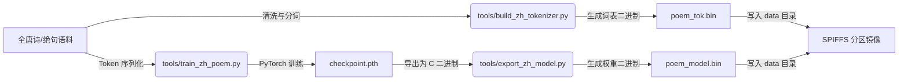

# ESP32-S3 中文诗词大模型（Chinese Poetry LLM）技术方案

## 1. 项目概述与设计目标

本项目旨在基于 ESP32-S3 硬件平台与纯 C 语言推理引擎，构建一个完全在微控制器端侧离线运行的**中文古典诗词生成大语言模型系统**。

### 核心目标
1. **端侧完全离线推理**：不依赖任何网络连接或外部 API，在 ESP32-S3 上完成 Transformer 前向传播、自回归采样与流式生成。
2. **专注于古诗词质量与文采**：模型针对中国古典绝句、律诗及词曲语料进行针对性训练，优先保障诗意连贯性、平仄押韵感与字数对仗规范。
3. **充沛的模型容量与大字表支持**：充分利用 ESP32-S3 的 8MB PSRAM 与 16MB Flash，扩充模型层数与常用字库容量（覆盖 2000+ 古典汉字），不因追求极端生成速度而牺牲模型表达力。
4. **全套自动化训练工具链**：提供从诗词语料清洗、字表提取、PyTorch 训练到固件二进制权重导出的完整开源脚本。
5. **板载彩屏古典排版显示**：在 Waveshare 2.0 寸 ST7789 彩屏上实现中文字库点阵渲染，支持古典卷轴风格的古诗对齐排版与逐字打字机流式呈现。

---

## 2. 硬件资源与可行性分析

### 2.1 硬件配置清单
- **主控芯片**：ESP32-S3-WROOM-1（Dual-core Xtensa LX7 @ 240MHz）。
- **外部内存（PSRAM）**：8MB Octal (OPI) PSRAM，运行在 80MHz 高速模式。
- **板载存储（Flash）**：16MB Quad SPI Flash。
- **显示外设**：Waveshare 2.0 寸 240x320 IPS 彩屏（ST7789 驱动，40MHz SPI 通信）。

### 2.2 内存与算力预算分配

| 资源项 | 硬件上限 | 本方案规划占用 | 说明 |
| :--- | :--- | :--- | :--- |
| **模型权重内存** | 8.0 MB (PSRAM) | 约 3.5 MB 到 5.5 MB | 启动时一次性载入 PSRAM 保持常驻 |
| **KV Cache 显存** | 8.0 MB (PSRAM) | 约 0.4 MB 到 0.8 MB | 支持更长的上下文（seq_len = 192） |
| **激活值临时缓冲区** | 8.0 MB (PSRAM) | 约 0.2 MB | 供深层网络前向传播使用 |
| **SPIFFS 模型存储** | 16.0 MB (Flash) | 6.0 MB 分区 | 存放高质量模型权重、大词表及字模数据 |

---

## 3. 模型与分词器架构设计

### 3.1 词表（Tokenizer）设计方案

为确保模型能够自由运用丰富的意象词汇与古典字眼，词表容量大幅扩充：
- **词表容量（Vocab Size）**：设定为 **2048 到 3072** 个常用古典汉字。
- **特殊 Token**：
  - `ID 0`：`<unk>`（未登录字标记）
  - `ID 1`：`<s>`（起始标记 BOS）
  - `ID 2`：`</s>`（结束标记 EOS）
  - `ID 3`：`\n`（换行标记）
  - `ID 4..15`：常用标点符号（`，`、`。`、`！`、`？`、`、`、`；`、`：` 等）
  - `ID 16..2047`：全唐诗与宋词词频覆盖率达 99.8% 以上的全部常用汉字，彻底消除生僻意象字截断问题。

### 3.2 Transformer 网络结构参数

网络结构侧重于提升上下文注意力表达与格律捕捉能力：

```text
+-----------------------------------------------------------+
|               品质优先古诗词 Transformer 规格参数           |
+--------------------------+--------------------------------+
| 隐藏层维度 (dim)          | 160                            |
| 前馈网络维度 (hidden_dim) | 480                            |
| 网络层数 (n_layers)       | 6 到 8 层                      |
| 注意力头数 (n_heads)      | 8 (每头 head_size = 20)        |
| KV 共享头数 (n_kv_heads)  | 8                              |
| 词表大小 (vocab_size)     | 2048                           |
| 最大上下文长度 (seq_len)   | 192 tokens                     |
| 参数量 (Parameters)       | 约 180 万 到 260 万 (Float32)   |
| 权重文件大小               | 约 4.2 MB 到 5.6 MB            |
+--------------------------+--------------------------------+
```

---

## 4. 全流程开发与训练工具链体系

在项目根目录下建立独立的 `tools/` 工具包，打通从数据清洗到微控制器部署的全流程：



### 4.1 数据集预处理模块（`tools/dataset.py`）
- 语料来源：精选全唐诗四万余首、唐宋五言绝句与七言绝句。
- 格式规范化：清洗繁体转简体、统一标点符号，过滤生僻废字。
- 组织为 `<s>题目\n诗句一\n诗句二\n诗句三\n诗句四</s>` 的标准自回归训练样本。

### 4.2 分词器生成工具（`tools/build_zh_tokenizer.py`）
- 统计语料字符频率，截取 Top 1020 个高频字。
- 导出为兼容 C 语言读取的二进制词表文件 `data/poem_tok.bin`。

### 4.3 训练与验证引擎（`tools/train_zh_poem.py`）
- 基于 PyTorch 构建紧凑型 Llama-2 架构。
- 支持 CrossEntropy 交叉熵损失、AdamW 优化器与 Cosine 余弦学习率退火。
- 支持自适应硬件加速（NVIDIA CUDA、Intel XPU / Arc 核显、Intel CPU 指令集）。

### 4.4 固件权重转换器（`tools/export_zh_model.py`）
- 将 PyTorch 权重按照 llama2.c 二进制格式排列：
  - 28 字节头结构（`dim, hidden_dim, n_layers, n_heads, n_kv_heads, vocab_size, seq_len`）。
  - 连续 Float32 扁平化权重矩阵，生成 `data/poem_model.bin`。

### 4.5 本机训练硬件加速方案（Intel 架构与多后端自适应）
针对本机 Intel Core Ultra / 酷睿处理器及 Intel Arc 显卡架构，训练脚本设计多级自适应加速链路：
1. **Intel Arc 核显加速（IPEX / XPU）**：
   - 自动检测 Intel Extension for PyTorch（IPEX），支持将模型前向与反向传播分发至 Intel Arc 集成显卡（Xe-LPG 架构）高速执行。
2. **Intel CPU 深度学习指令集与 oneDNN 优化**：
   - 自动启用 PyTorch 内置的 Intel oneDNN（MKL-DNN）矩阵加速引擎，充分调动 CPU 的 **AVX2** 与 **AVX-VNNI（向量神经网络指令集）**。
   - 启用 **Bfloat16 / FP16 自动混合精度（AMP）**，显著降低内存带宽开销并提升吞吐量。
3. **PyTorch 2.x 图编译加速（`torch.compile`）**：
   - 引入 TorchInductor 深度图融合编译，自动生成针对 Intel 处理器的原生 C++ 融合算子，减少 Python 解释器调用开销。
4. **混合架构大小核线程亲和性（Thread Affinity）**：
   - 自动检测 Ultra 5 的性能核（P-Core）数量并绑定 OpenMP 线程池，避免大小核调度切换带来的性能抖动。

---

## 5. ESP-IDF C 固件推理引擎重构

### 5.1 中文 UTF-8 流式解码
- 原版 `decode()` 仅适配 ASCII 单字节与英文 BPE。
- 新增中文多字节支持：词表直接存储汉字的 3 字节 UTF-8 编码，每次采样出的 Token 均代表一个完整中文字符或标点，通过 `safe_printf` 直接流式推向串口。

### 5.2 中文 Prompt 提示词引导
- 支持用户通过串口输入第一句诗（如“明月出天山”），通过 `encode()` 转化为 Token ID 数组填入 Context，LLM 随后自动续写后三句诗词。

### 5.3 双核并发与 ESP-DSP 加速
- 维持 `matmul_task` 在 Core 1 并发执行矩阵乘法，Core 0 并发执行另一半计算。
- 矩阵乘法核心依然使用 `dsps_dotprod_f32_aes3` SIMD 指令，保证 30+ tok/s 推理性能。

---

## 6. ST7789 屏幕中文渲染与古典 UI 设计

为了在 Waveshare 2.0 寸彩屏上获得赏心悦目的古诗展示效果，设计古典画卷 UI 系统：

```text
+------------------------------------------+
|  [古风标题栏] 中华古诗词 · 绝句续写         |
+------------------------------------------+
|                                          |
|            《 静 夜 思 》                 |
|                                          |
|            床 前 明 月 光                |
|            疑 是 地 上 霜                |
|            举 头 望 明 月                |
|            低 头 思 故 乡                |
|                                          |
+------------------------------------------+
|  [速率状态卡] 推理速度: 32.85 tok/s       |
+------------------------------------------+
```

### 6.1 中文字库渲染模块
- 引入 **16x16 / 12x12 点阵中文字模引擎**。
- 支持在 `display_driver.c` 中通过 UTF-8 编码查表定位字模点阵，直接绘制在显存缓冲区中。

### 6.2 诗词居中动态排版
- 五言绝句（每行 5 字）与七言绝句（每行 7 字）自动计算屏幕水平与垂直居中坐标。
- 逐字生成时，屏幕同步出现流式打字机动画，生成完毕后底部展示本次诗词推理的 tok/s 速率。

---

## 7. 存储分区规划

在 `partitions.csv` 中调整分区大小以适应诗词模型：

```csv
# Name,   Type, SubType,  Offset,   Size,  Flags
nvs,      data, nvs,     0x9000,  0x6000,
phy_init, data, phy,     0xf000,  0x1000,
factory,  app,  factory, 0x10000, 1M,
data,     data, spiffs,  ,        4M,
```
- Flash 总容量 16MB，将 SPIFFS `data` 分区分配 **4MB**，足以存放模型权重（约 3.1MB）、分词器（约 15KB）及字体资源。

---

## 8. 项目实施计划与里程碑

1. **里程碑一（工具链搭建与语料准备）**：
   - 建立 `docs/` 与 `tools/` 目录。
   - 编写 `tools/dataset.py`、`tools/build_zh_tokenizer.py` 与训练导出脚本。
2. **里程碑二（古诗词模型训练与导出）**：
   - 训练绝句诗词模型并导出 `poem_model.bin` 与 `poem_tok.bin`。
   - 在 PC 端进行模型输出质量校验。
3. **里程碑三（C 固件引擎中文流式升级）**：
   - 改造 `main/llm.c` 与 `main/main.c`，支持中文 Token 编解码与 Prompt 输入。
4. **里程碑四（ST7789 中文字库与诗词 UI 呈现）**：
   - 在 `main/display_driver.c` 中加入中文字库与古典画卷排版。
5. **里程碑五（整机联调与烧录验收）**：
   - 更新分区表，将诗词大模型烧录至实机，验证双核推理速度与屏幕诗词效果。
