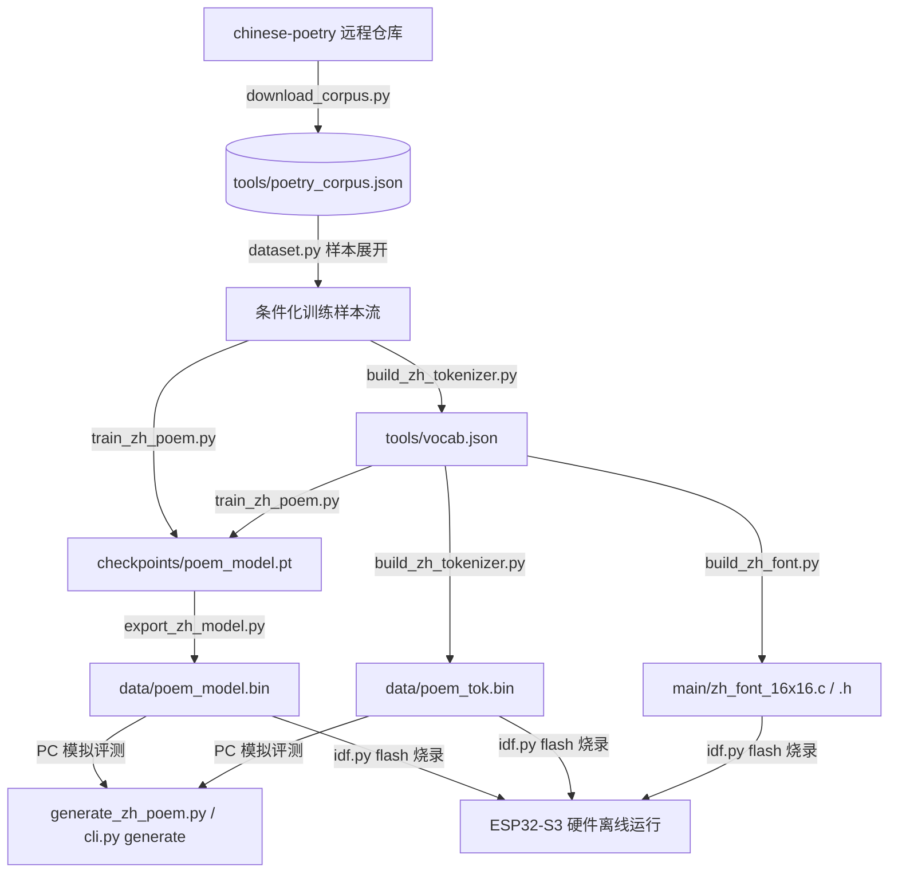

# ESP32 中文古典诗词大模型 工具链 (tools/)

本目录包含自训练古典诗词 Transformer 模型的完整工具集，涵盖从语料下载、分词器构建、模型训练、权重二进制导出、ESP32 屏幕点阵字库生成，到 PC 端韵律推理模拟的完整链路。

---

## 目录结构速览

```text
tools/
├── cli.py                  # [推荐] 统一命令行入口，集成全套工作流
├── README.md               # 工具链文档与流程说明（本文档）
│
├── 数据与分词 (Data & Tokenizer)
│   ├── download_corpus.py  # 从全唐诗下载并清洗语料，生成 poetry_corpus.json
│   ├── build_zh_tokenizer.py # 按字频统计构建 2048 字符级词表与 llama2.c 二进制词表
│   ├── dataset.py          # 诗词主题/体裁条件化样本构造与防泄露数据集划分
│   ├── poetry_corpus.json  # 清洗后的唐诗语料数据 (~1.08 万首)
│   └── vocab.json          # 导出的 2048 字符映射表
│
├── 模型与训练 (Model & Training)
│   ├── model.py            # PyTorch Llama-2 模型定义 (RMSNorm / RoPE / SwiGLU)
│   ├── train_zh_poem.py    # 训练主程序 (支持 CPU / Intel XPU / CUDA 加速)
│   └── export_zh_model.py  # PyTorch 权重导出为 llama2.c 二进制格式 (data/poem_model.bin)
│
├── 硬件部署与点阵字库 (Hardware & Font)
│   └── build_zh_font.py    # 按词表 token id 渲染 16x16 黑体点阵并生成 C 代码
│
└── 推理与测试 (Inference & Evaluation)
    └── generate_zh_poem.py # PC 端推理模拟器，集成中华通韵与硬约束句长解码
```

---

## 统一工具链 CLI（推荐）

通过 `tools/cli.py` 可以统一调度所有工具模块：

```bash
# 1. 运行 PC 端诗词创作与测试
python tools/cli.py generate --prompt "主题：明月 体裁：五绝" --count 3

# 2. 从网络下载并清洗全唐诗语料 (输出到 tools/poetry_corpus.json)
python tools/cli.py download --volumes 12

# 3. 统计字频并生成分词器 (输出 tools/vocab.json 与 data/poem_tok.bin)
python tools/cli.py tokenizer --vocab-size 2048

# 4. 执行全量模型训练并自动回滚最优权重、导出模型
python tools/cli.py train

# 5. 重新生成 ESP32 彩屏 16x16 中文点阵字库 (main/zh_font_16x16.c/.h)
python tools/cli.py font

# 6. 从现有 PyTorch Checkpoint 导出 data/poem_model.bin
python tools/cli.py export

# 7. 清理 Python 编译缓存文件
python tools/cli.py clean
```

---

## 完整工作流与数据流图



---

## 各脚本职责与关键注意事项

### 1. 语料与分词 (`download_corpus.py` / `build_zh_tokenizer.py`)
* 语料经繁简转换、残缺字过滤（去除 `□`、`*`、超长长诗等），保留规整的绝句与律诗约 1.08 万首。
* 词表大小设定为 2048，前 4 个为特殊 token（`<unk>`、`<s>`、`</s>`、`\n`），后续为标点数字及高频汉字。

### 2. 模型训练与权重导出 (`train_zh_poem.py` / `export_zh_model.py`)
* 模型规格：`dim=96`，`hidden_dim=256`，`layers=5`，`heads=6`，`seq_len=128`，参数量约 75 万。
* 硬件自适应：支持 Intel Core Ultra NPU/iGPU/CPU（XPU）、NVIDIA CUDA 及 CPU。
* 训练产物分别存放：PyTorch 权重保存在 `checkpoints/poem_model.pt`；固件权重保存在 `data/poem_model.bin`。切勿将 `.pt` 放入 `data/` 目录，避免撑爆 SPIFFS 分区。

### 3. 点阵字库生成 (`build_zh_font.py`)
* ⚠️ **字库与词表强耦合**：`main/zh_font_16x16.c` 是按 token id 直接索引的 16x16 点阵。一旦修改语料或重新构建了词表，必须重新运行 `python tools/cli.py font`（或 `python tools/build_zh_font.py`），否则屏幕将索引到错字。

### 4. PC 端推理模拟器 (`generate_zh_poem.py`)
* 支持提示词格式：`主题：X 体裁：Y\n`（体裁支持：五绝、七绝、五律、七律、五言、七言）。
* 内置中华通韵约束解码（偶数句末字强制同韵部）与硬约束句长断句，方便在电脑上快速验证诗词生成效果。
